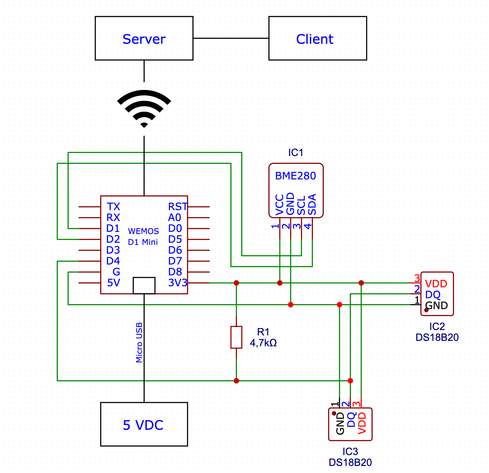

# Aufbau der Schaltung

# Datenblätter

[BME280](https://www.mouser.com/datasheet/2/783/BST-BME280-DS002-1509607.pdf)

[BME280 Sensormodul](https://cdn.shopify.com/s/files/1/1509/1638/files/BME280_Barometrischer_Sensor_Modul_Datenblatt_AZ-Delivery_Vertriebs_GmbH.pdf?v=1608218816)

[DS18B20](https://www.analog.com/media/en/technical-documentation/data-sheets/ds18b20.pdf)
