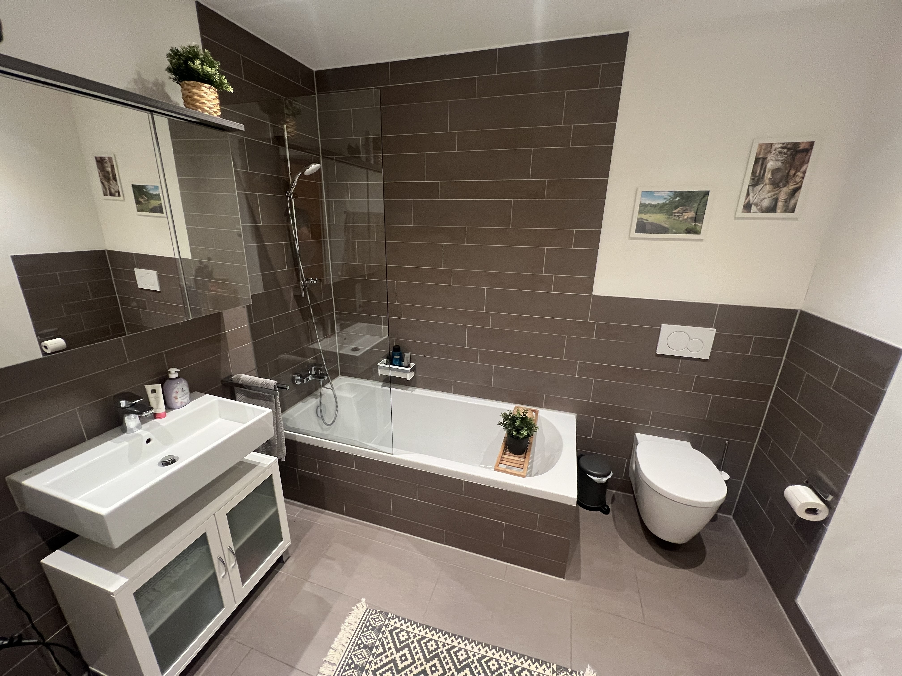
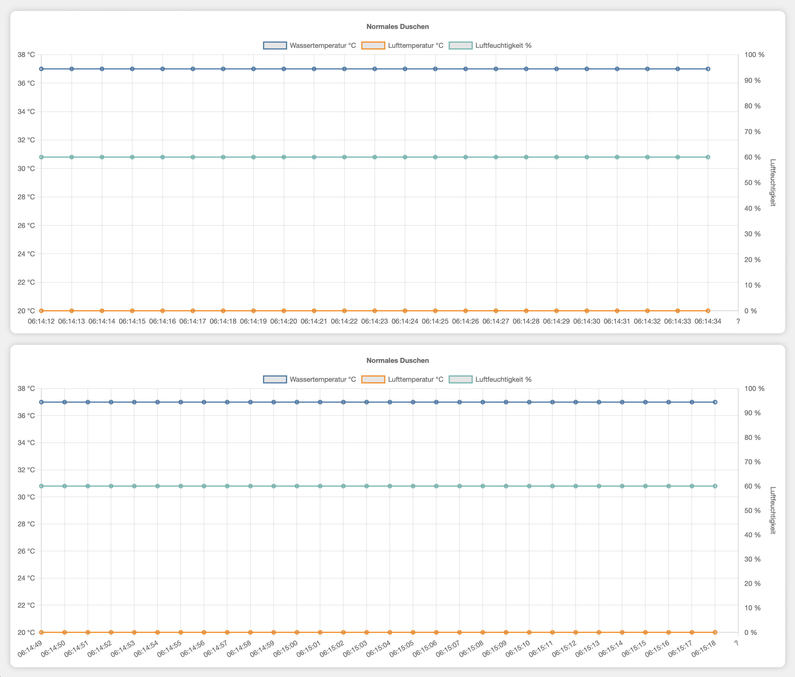

# Sparen durch Auffangen des Duschwassers

Glaubt ihr, dass ihr im Winter ca. 60 % eurer Duschkosten einsparen könnt, einfach indem ihr euren Badewannen-Stöpsel vor dem Duschen einsteckt? Klingt wild, oder? Ich möchte die Aussage mit diesem Text etwas genauer untersuchen.

Neulich beim Duschen habe ich mich gefragt, wie viel Wärmeenergie eigentlich über das Wasser zwischen meinen Füßen im Abfluss verschwindet und unnötigerweise das Abwassersystem erwärmt. Könnte man den Nutzen des warmen Wassers nicht weiter erhöhen?

Stellen wir uns vor, ihr schließt vor dem Duschen den Badewannenstöpsel und lasst das Wasser erst dann ab, wenn es vollständig abgekühlt ist. Das wäre natürlich nur im Winter vorteilhaft, aber die Abkühlung erfolgt immerhin durch einen Wärmeübertrag an die Umgebung. Demnach heizt das Duschwasser zusätzlich die Raumluft, wodurch Heizkosten gesenkt werden können. Schauen wir uns hierzu eine Überschlagsrechnung an.

## Annahmen

- Menge des Wassers nach 10 Minuten Duschzeit: 150 Liter
- Warmwassertemperatur: 37 °C
- Kaltwassertemperatur 10 °C
- Raumtemperatur (Endtemperatur des Wassers): 20 °C
- Heizkosten: 0,11 €/kWh
- Vernachlässigung von Verdunstungseffekten
- Keine Berücksichtigung der Isolationssituation

## Überschlagsrechnung:

1. Benötigte Wärmeenergie für Duschwasser
   $$Q = m \times c \times ΔT = 150 \text{ kg} \times 4186 \text{ J/kg°C} \times (37\text{ °C} - 10\text{ °C}) \approx 16.953 \text{ kJ} \approx 4,71 \text{ kWh}$$

1. Abgabe Wärmeenergie an Umgebung:
   $$Q = m \times c \times ΔT = 150 \text{ kg} \times 4186 \text{ J/kg°C} \times (37\text{ °C} - 20\text{ °C}) \approx 10.674 \text{ kJ} \approx 2,97 \text{ kWh}$$

1. Einsparpotential:
   $$Einsparung = \frac{2,97 \text{ kWh}}{4,71 \text{ kWh}} \approx 63\text{ Prozent} $$

1. Potentielle Einsparung an Heizkosten je Duschgang:
   $$Einsparung = 2,97 \text{ kWh} \times \frac{0,11 €}{\text{kWh}} = 0,33 \text{ €}$$

## Ergebnis

Durch das Abkühlen des gesammelten Duschwassers übertragen wir demnach eine Wärmeenergie von ca. 10.000 kJ an unsere Wohnung, was 3 kWh entspricht. Demnach ließen sich in der kalten Jahreszeit potentiell 0,33 € Heizkosten je Duschgang einsparen. Statistisch betrachtet heizen die meisten Menschen zwischen Oktober und April. Angenommen ein vier Personenhaushalt duscht in der Zeitspanne jeweils 20 Tage pro Monat entspricht dies einer potentiellen Einsparung von 158,40 €.

## Abkühldauer und Luftfeuchtigkeit

Für eine gewisse Praxistauglichkeit stellt sich mir noch die Frage in welcher Zeit das Duschwasser abkühlt und welchen Einfluss das Speichern des Duschwassers auf die Raumluftfeuchte hat. Das ist nicht ganz leicht zu beantworten, da vorraussichtlich bereits das eigentliche Duschen zu einer signifikaten Steigerung der Raumluftfeuchte führt. Ferner ist die rechnerische Ermittlung der Abkühldauer mangels präzisem k-Faktor zu ungenau, weswegen ich ein Experiment zur Beantwortung der Frage durchgeführt habe.

## Experiment

Um die Veränderung von Wasser-/Lufttemperatur und Raumluftfeuchte über der Zeit zu Messen, verwenden wir zwei baugleiche Temperatur- und einen Feuchtigkeitssensor. Die absolute Messgenauigkeit der Sensoren kann vernachlässt werden, da für das Experiment primär die relative Änderungen von Bedeutung ist. Wer sich für den genauen Hardwareaufbau interessiert, kann diesen [hier](/HARDWARE.md) einsehen. Die Auswirkung der Aufstauung wird über die Differenzbetrachtung zweier Versuche untersucht. Ein Versuch für den typischen Duschvorgang und ein Versuch mit Wasseranstauung. Die Messung läuft so lange, bis die Messwerte der Ausgangssituation vor dem Duschen entsprechen. Die zwei Versuche werden an unterschiedlichen Tagen durchgeführt um sicherzustellen, dass die Wände ihre normalen Temperatur- und Feuchtigkeitswerte erreicht haben.

### Versuchsaufbau

- Mischbatterie auf maximalen Volumenstrom und maximaler Temperatur eingestellt
- PT100 zur Wassertemperaturbestimmung in Badewanne in kleinem Kunststoffgefäß zum anstauen des Wassers beim regulären Duschen
- PT100 zur Raumtemperaturbestimmung massearm an stativ in Raummitte
- DHT22 ebenfalls in Raummitte
- Vergleichbare Außen-/ und Umgebungstemperatur sowie Luftfeuchte bei beiden Versuchen

Folgt...

### Messfehler

Das Experiment wird in einem innenliegendes Badezimmer mit aktiver Lüftung durchgeführt. Das bedeutet, dass ich die durch den Duschvorgang entstandene Luftfeuchtigkeit nicht durch ein Stoßlüften abbauen kann. Hierdurch wird der Einfluss des aufgestauten Wassers auf die Gesamtluftfeuchte innerhalb der Messauflösung vermutlich schwer zu beurteilen. Des Weiteren handelt es sich nicht um ein wissenschaftliches Experiment mit reproduzierbaren und präzisen Umgebungsbedingungen. Dies sollte bei der Bewertung der Ergebnisse berücksichtigt werden.

### Ergebnis

Folgt...

## Fazit und eigene Meinung

Folgt

## Social Media Bild

