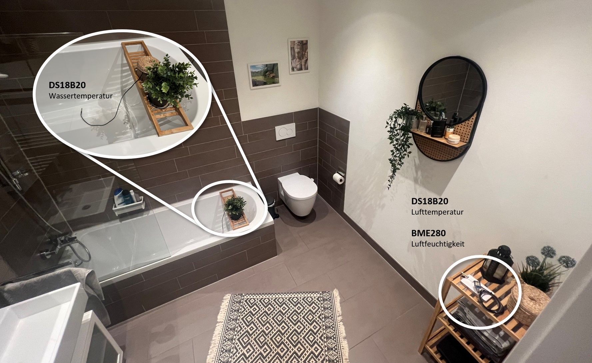

# Sparen durch Auffangen des Duschwassers

Glaubt ihr, dass ihr im Winter ca. 60 % eurer Duschkosten einsparen könnt, einfach indem ihr euren Badewannen-Stöpsel vor dem Duschen einsteckt? Klingt gewagt, nicht wahr? Ich möchte die Aussage mit diesem Text etwas genauer untersuchen.

Neulich beim Duschen habe ich mich gefragt, wie viel Wärmeenergie eigentlich über das Wasser zwischen meinen Füßen im Abfluss verschwindet und unnötigerweise das Abwassersystem erwärmt. Könnte man den Nutzen des warmen Wassers nicht weiter erhöhen?

Stellen wir uns vor, ihr schließt vor dem Duschen den Badewannenstöpsel und lasst das Wasser erst dann ab, wenn es vollständig abgekühlt ist. Das wäre natürlich nur im Winter vorteilhaft, aber die Abkühlung erfolgt immerhin durch einen Wärmeübertrag an die Umgebung. Demnach heizt das Duschwasser zusätzlich die Raumluft, wodurch Heizkosten gesenkt werden können. Schauen wir uns hierzu eine Überschlagsrechnung an.

## Annahmen

- Menge des Wassers nach 10 Minuten Duschzeit: 150 Liter
- Warmwassertemperatur: 37 °C
- Kaltwassertemperatur 10 °C
- Raumtemperatur (Endtemperatur des Wassers): 20 °C
- Heizkosten: 0,11 €/kWh
- Vernachlässigung von Verdunstungseffekten
- Keine Berücksichtigung der Isolationssituation

## Überschlagsrechnung:

1. Benötigte Wärmeenergie für Duschwasser
   $$Q = m \times c \times ΔT = 150 \text{ kg} \times 4186 \text{ J/kg°C} \times (37\text{ °C} - 10\text{ °C}) \approx 16.953 \text{ kJ} \approx 4,71 \text{ kWh}$$

1. Abgabe Wärmeenergie an Umgebung:
   $$Q = m \times c \times ΔT = 150 \text{ kg} \times 4186 \text{ J/kg°C} \times (37\text{ °C} - 20\text{ °C}) \approx 10.674 \text{ kJ} \approx 2,97 \text{ kWh}$$

1. Einsparpotential:
   $$Einsparung = \frac{2,97 \text{ kWh}}{4,71 \text{ kWh}} \approx 63\text{ Prozent} $$

1. Potentielle Einsparung an Heizkosten je Duschgang:
   $$Einsparung = 2,97 \text{ kWh} \times \frac{0,11 €}{\text{kWh}} = 0,33 \text{ €}$$

## Ergebnis

Durch das Abkühlen des aufgestauten Duschwassers übertragen wir rechnerisch eine Wärmeenergie von ca. 3 kWh bzw. 63 % unserer aufgewendeten Wärmeenergie an die Umgebung. Demnach ließen sich in der kalten Jahreszeit potentiell 0,33 € Heizkosten je Duschgang einsparen. Statistisch betrachtet heizen die meisten Menschen zwischen Oktober und April. Angenommen ein Vierpersonenhaushalt duscht in der Zeitspanne jeweils 20 Tage pro Monat entspricht dies einer potentiellen Einsparung von 158,40 €.

## Abkühldauer und Luftfeuchtigkeit

Für eine gewisse Praxistauglichkeit stellt sich mir noch die Frage in welcher Zeit das Duschwasser abkühlt und welchen Einfluss das Speichern des Duschwassers auf die Raumluftfeuchte hat. Das ist rechnerisch nicht ganz leicht zu beantworten, da vorraussichtlich bereits das eigentliche Duschen zu einer signifikaten Steigerung der Raumluftfeuchte führt. Ferner ist die rechnerische Ermittlung der Abkühldauer mangels präzisem k-Faktor zu ungenau, weswegen ein Experiment zur Beantwortung der Frage durchzuführen ist.

## Experiment

### Vorwort

Wir wohnen in einem gut isolierten Neubau mit innenliegendem Badezimmer und aktiver Lüftung. Mein Ziel ist eine Vergleichsmessung zwischen einem üblichen Duschgang und einem Duschgang, bei dem das Wasser in der Wanne angestaut wird. Um möglichst gleiche Umgebungsbedingungen zu schaffen, stelle ich die Mischbatterie auf volle Temperatur sowie maximalen Volumenstrom und stoppe die Zeit.

Bei diesem Vorgehen sind mehrere Fehlerquellen erwartbar. Beispiel:

- Variation im Volumenstrom und der Zulauftemperatur
- Luftdruckunterschiede führen zu unterschiedlich effektiver Lüftung
- Potential der Umgebung Feuchtigkeit zu speichern

Die Vergleichsmessreihe hat daher nicht den Anspruch eines korrekt durchgeführten Experimentes, aber ich erhoffe mir aus den Messwerte dennoch eine Tendenz. Wir führen die Messung so lange durch, bis sich die Wassertemperatur der Umgebungstemperatur angeglichen hat.

### Versuchsaufbau

Ich verwende zwei WLAN-fähige Mikrokontroller mit jeweils einem baugleichen Temperatursensor. Am entfernten Mikrokontroller ist zusätzlich ein Luftfeuchtigkeitssensor angeschlossen. Beide Mikrokontroller schreiben ihre Messwerte über Netzwerkprotokolle in eine Zeitreihendatenbank auf meinem Heimserver. Die Visualisierung erfolgt über Grafana.

### Messung des normalen Duschgangs

Experiment folgt...

### Messung des Duschgangs mit Wasseranstauung

Experiment folgt...

## Social Media Bild

