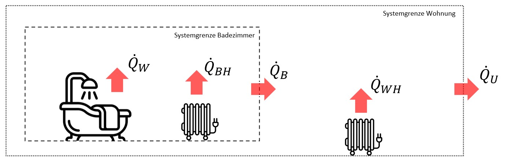
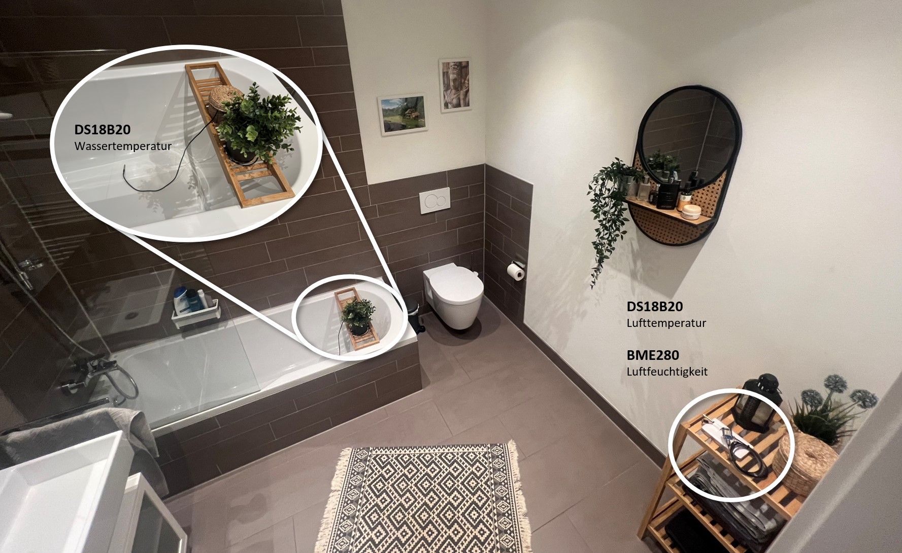
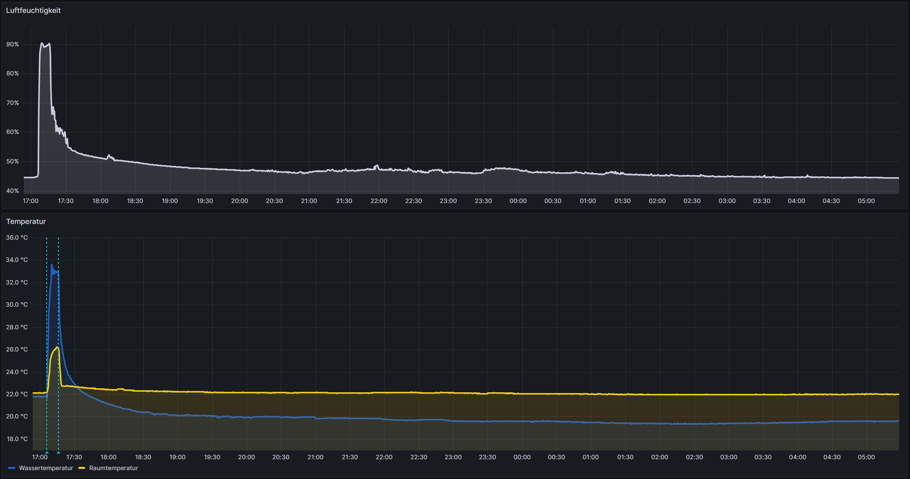
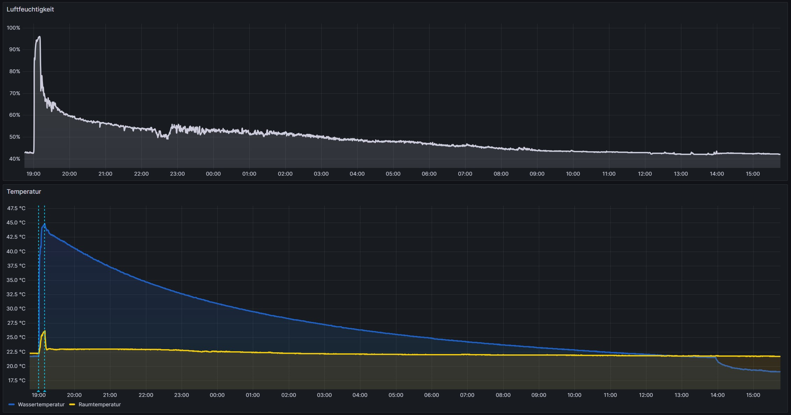
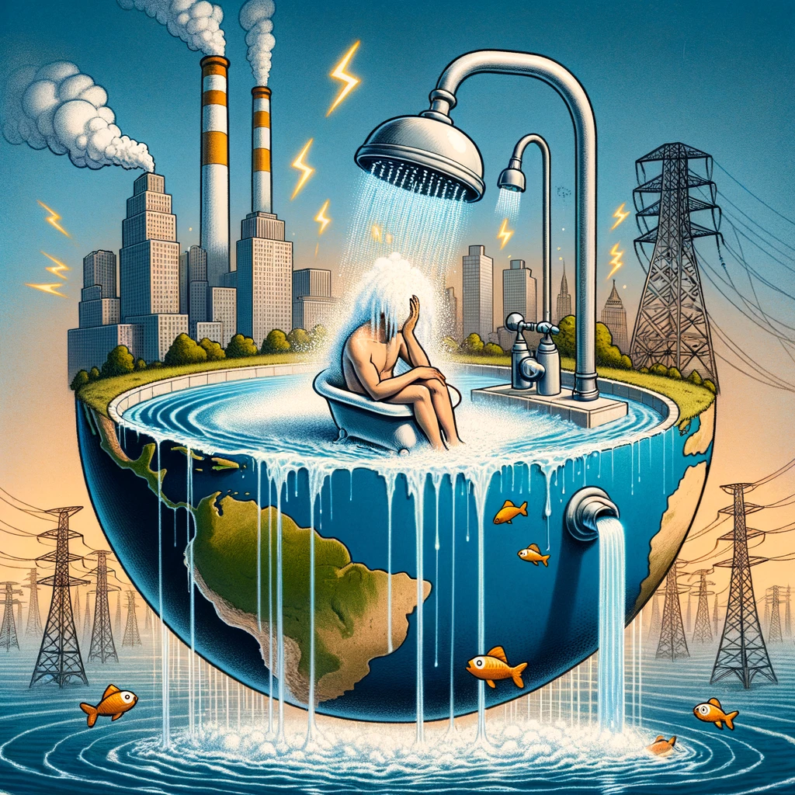

# Sparen durch Auffangen des Duschwassers

Ihr könnt in den kalten Wintermonaten 60 % eurer Wärmeenergie beim Duschen einsparen, ohne die Temperatur oder Wassermenge zu reduzieren. Klingt gewagt, nicht wahr? Ich möchte die Aussage mit diesem Text etwas genauer untersuchen.

Neulich beim Duschen habe ich mich gefragt, wie viel Wärmeenergie eigentlich über das Wasser zwischen meinen Füßen im Abfluss verschwindet und unnötigerweise das Abwassersystem erwärmt. Könnte man den Nutzen des warmen Wassers nicht weiter erhöhen? Rund um dieses Thema gibt es bereits verschiedene kommerzielle Lösungen, aber ich denke es gibt einen praktisch kostenlosen Ansatz ohne signifikante Wirkungsgradverluste.

Stellen wir uns vor, ihr schließt vor dem Duschen den Badewannenstöpsel und lasst das Wasser erst dann ab, wenn es vollständig abgekühlt ist. Das wäre natürlich nur im Winter vorteilhaft, aber die Abkühlung erfolgt immerhin durch einen Wärmeübertrag an die Umgebung. Demnach heizt das Duschwasser zusätzlich die Raumluft, wodurch Heizkosten gesenkt werden können. Der vom aufgestauten Duschewasser abgegebene Wärmestrom reduziert die erforderliche Heizleistung der Badezimmerheizung und je nach Wärmemenge entsprechend auch der Wohnraumheizung. Schlussendlich entspricht das Badewasser einem gedachten Heizkörper. Wie viel diese zusätzliche Wärmequelle bringt, habe ich mir mit der folgenden Rechnung angeschaut.

## Annahmen

- Menge des Wassers nach 10 Minuten Duschzeit: 150 Liter
- Warmwassertemperatur: 37 °C
- Kaltwassertemperatur 10 °C
- Raumtemperatur (Endtemperatur des Wassers): 20 °C
- Heizkosten: 0,11 €/kWh
- Vernachlässigung von Verdunstungseffekten
- Keine Berücksichtigung der Isolationssituation

## Überschlagsrechnung:

1. Benötigte Wärmeenergie für Duschwasser
   $$Q = m \times c \times ΔT = 150 \text{ kg} \times 4186 \text{ J/kg°C} \times (37\text{ °C} - 10\text{ °C}) \approx 16.953 \text{ kJ} \approx 4,71 \text{ kWh}$$

1. Abgabe Wärmeenergie an Umgebung:
   $$Q = m \times c \times ΔT = 150 \text{ kg} \times 4186 \text{ J/kg°C} \times (37\text{ °C} - 20\text{ °C}) \approx 10.674 \text{ kJ} \approx 2,97 \text{ kWh}$$

1. Energie Einsparpotential:
   $$Einsparung = \frac{2,97 \text{ kWh}}{4,71 \text{ kWh}} \approx 63\text{ Prozent} $$

1. Potentielle Einsparung an Heizkosten je Duschgang:
   $$Einsparung = 2,97 \text{ kWh} \times \frac{0,11 €}{\text{kWh}} = 0,33 \text{ €}$$

## Ergebnis

Durch das Abkühlen des aufgestauten Duschwassers übertragen wir rechnerisch eine Wärmeenergie von ca. 3 kWh bzw. 63 % unserer, zum Duschen aufgewendeten, Wärmeenergie an die Umgebung. Demnach ließen sich in der kalten Jahreszeit potentiell 0,33 € Heizkosten je Duschgang einsparen. Statistisch betrachtet heizen die meisten Menschen zwischen Oktober und April. Angenommen ein Vierpersonenhaushalt duscht in der Zeitspanne jeweils 20 Tage pro Monat entspricht dies einer potentiellen Einsparung von 158,40 €.

## Abkühldauer und Luftfeuchtigkeit

Für eine gewisse Praxistauglichkeit stellt sich mir noch die Frage in welcher Zeit das Duschwasser abkühlt und welchen Einfluss das Speichern des Duschwassers auf die Raumluftfeuchte hat. Das ist rechnerisch nicht ganz leicht zu beantworten, da vorraussichtlich bereits das eigentliche Duschen zu einer signifikaten Steigerung der Raumluftfeuchte führt. Ferner ist die rechnerische Ermittlung der Abkühldauer mangels präzisem k-Faktor zu ungenau, weswegen ein Experiment zur Beantwortung der Frage durchzuführen ist.

## Experiment

### Vorwort

Wir wohnen in einem gut isolierten Neubau mit innenliegendem Badezimmer und aktiver Lüftung. Mein Ziel ist eine Vergleichsmessung zwischen einem üblichen Duschgang und einem Duschgang, bei dem das Wasser in der Wanne angestaut wird. Um möglichst gleiche Umgebungsbedingungen zu schaffen, stelle ich die Mischbatterie auf volle Temperatur sowie maximalen Volumenstrom und stoppe die Zeit.

Bei diesem Vorgehen sind mehrere Fehlerquellen erwartbar. Beispiel:

- Variation im Volumenstrom und der Zulauftemperatur
- Luftdruckunterschiede führen zu unterschiedlich effektiver Lüftung
- Potential der Umgebung Feuchtigkeit zu speichern variiert

Die Vergleichsmessreihe hat daher nicht den Anspruch eines korrekt durchgeführten Experimentes, aber ich erhoffe mir aus den Messwerten dennoch eine Tendenzielle Antwort auf die initiale Frage.

### Versuchsaufbau

Ich verwende zwei WLAN-fähige Mikrokontroller mit jeweils einem baugleichen Temperatursensor. Am entfernten Mikrokontroller ist zusätzlich ein Luftfeuchtigkeitssensor angeschlossen. Beide Mikrokontroller schreiben ihre Messwerte über Netzwerkprotokolle in eine Zeitreihendatenbank auf meinem Heimserver. Die Visualisierung erfolgt über Grafana. Wer an dem Quellcode interessiert ist, findet den Programmcode im Dateiordner `evaluation`.

Umgebungsbedingungen:

- Badezimmer Tür geöffnet
- Raumlüftung eingeschaltet
- Mischbatterie auf volle Temperatur und vollen Volumenstrom eingestellt
- Befüllungsdauer 10 Minuten

## Messergebnisse während eines normalen Duschgangs

## Messergebnisse während eines Duschganges mit Anstauung des Wassers

## Fazit

Laut verschiedenen Quellen liegt die optimale Luftfeuchtigkeit eines Badezimmers zwischen 50-70%. Die Vergleichsmessung zeigt einen Abfall der beim Duschen entstandenen Luftfeuchte binnen weniger Minuten. Nach einer Stunde liegt die Luftfeuchte mit angestautem Wasser unterhalb von 60%. Die Luftfeuchtigkeit lässt sich vermutlich noch weiter senken, wenn nach dem Duschen ein Stoßlüften möglich ist.

Wie man an der Abkühlkurve des Wassers gut erkennen kann, erfolgt der Wärmeübertrag an die Umgebung nur langsam. Somit wäre zwar ein Abkühlungseffekt durch das Lüften weniger relevant, jedoch ist es wenig praktikabel, das Duschwasser über knapp 18 Stunden abkühlen zu lassen. Aufgrund der exponentiellen Abkühlung lässt sich jedoch innerhalb von 4-5 Stunden mehr als die Hälfte der Wärmeenergie übertragen. Die Praxistauglichkeit muss hier jeder für sich selbst bewerten.

In meinem Experiment habe ich nur sauberes Wasser verwendet. Kommt Shampoo und Schmutz in den Prozess, ist davon auszugehen, dass nach dem Entleeren der Badewanne ein Abdruck auf Höhe des Wasserpegels am Wannenrand verbleibt. Dies senkt weiter den Komfort durch den zusätzlichen Reinigungsaufwand und damit die Praxistauglichkeit.

Alles in allem fand ich die Untersuchung spannend und inspirierend. Es ist erstaunlich, welche Mengen an Energie in unserem Alltag noch nicht genutzt werden. Der Raum für Lösungen ist groß und muss stärker genutzt werden. Ferner hat es den Ingenieur in mir gefreut zu sehen, dass der Messwert des Temperatursensors in der Badewanne nach Entleerung des Wassers unter den Messwert der Raumlufttemperatur gefallen ist. Dies zeigt gut den Effekt der Verdunstungskälte, durch die Wasserrückstände auf der Messkopfoberfläche.

## Ausblick

- Potentiell größer dimensionierter Siphon könnte den Effekt praxistauglicher integrieren
- Nutzung in Einrichtungen wie Schwimmbäder, zur Beckenheizung - Stichwort Wärmetauscher
- Im Gebäude verbaute Wasserspeicher
- ...

Ich lade herzlich dazu ein, die Gedanken fortzuführen und bedanke mich für das Lesen!

## Social Media Post

